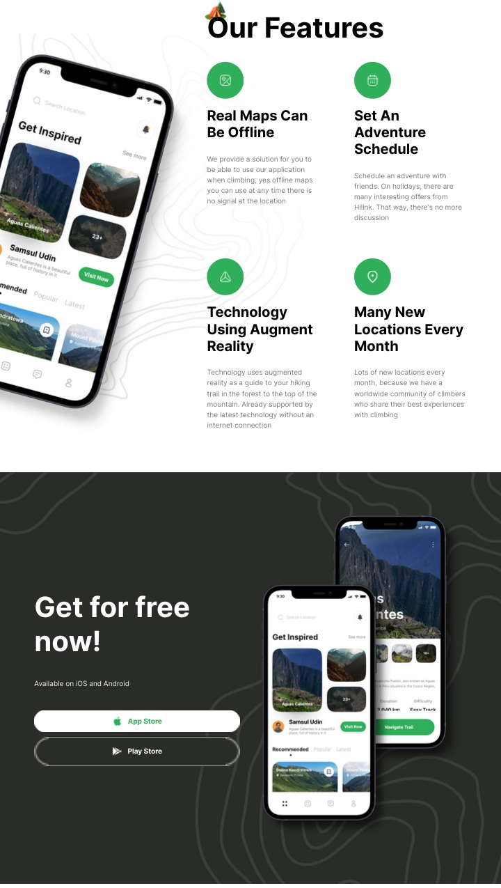

---

# HiLinks.

HiLinks is a modern travel application built with Next.js 14, React.js, TypeScript, and Tailwind CSS. It provides users with a seamless and intuitive platform to plan their travel itineraries, explore destinations, and book accommodations.

## Features

- **Dynamic Destination Search:** Utilize advanced search algorithms and dynamic filtering options to explore a vast array of destinations based on preferences.
- **Interactive Maps:** Visualize travel itineraries with precision using interactive maps powered by React.js.
- **Personalized Recommendations:** Curated recommendations based on user preferences ensure a personalized travel experience.
- **Real-time Booking:** Seamlessly reserve flights, accommodations, and activities directly within the app with real-time booking functionality.
- **Responsive Design:** Built with Next.js 14 and TypeScript, ensuring a responsive design across various devices and screen sizes.
- **Stunning Visuals:** Elevate travel planning with breathtaking visuals and animations crafted using Tailwind CSS.

## Installation

1. Clone the repository:

```bash
git clone https://github.com/Psamcyite/hilinks.git
```

2. Navigate to the project directory:

```bash
cd hilinks
```

3. Install dependencies:

```bash
npm install
```

4. Run the development server:

```bash
npm run dev
```

5. Open http://localhost:3000 in your browser to view the app.

## Technologies Used

- Next.js 14
- React.js
- TypeScript
- Tailwind CSS

## Contributing

Contributions are welcome! Feel free to open issues or submit pull requests.

## License

This project is licensed under the [MIT License](LICENSE).

## Screenshots




## Demo

A live demo of the app is available [here](https://your-demo-url.com).

---
